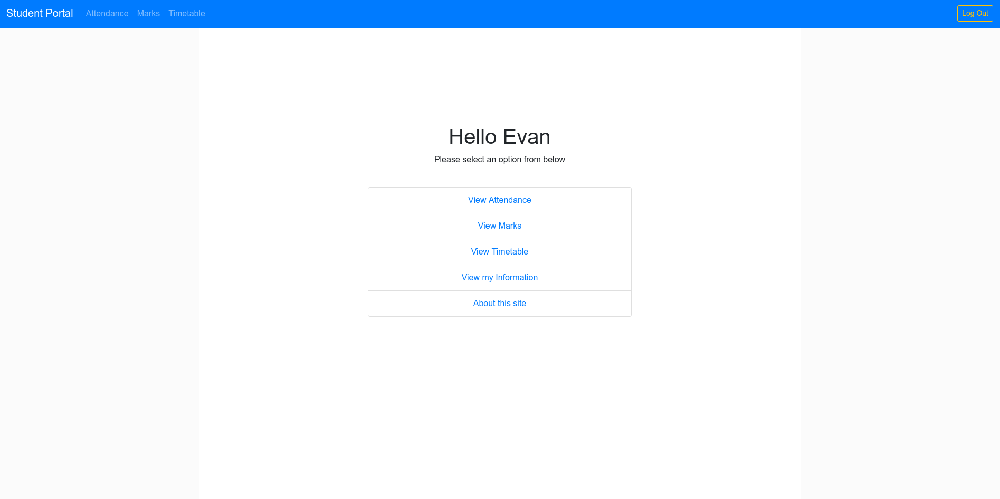
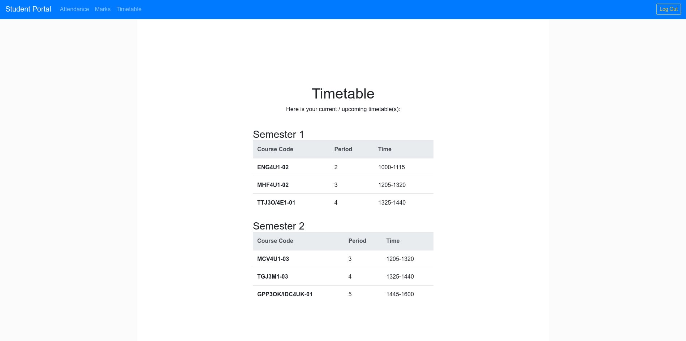

# Unofficial TVDSB Student Portal Webapp
Available at [studentportal.retrylife.ca](https://studentportal.retrylife.ca).

## Why?

The [Thames Valley District School Board](https://www.tvdsb.ca) provides students and parents with two webapps for managing and viewing student info, named [Student Portal](https://schoolapps2.tvdsb.ca/students/student_login/lgn.aspx) and [Parent Portal](https://schoolapps2.tvdsb.ca/parents/tvdsb_parents/) respectively. While the Parent Portal app is a reasonably modern website based around responsive design, the Student Portal is an old ASP.net page designed for Internet Explorer 7.0, on an 800x600 screen, and looks like it was built for a 3rd-grader.

This project is designed to hook in to the same "API" that is used by the Student Portal, but give students a much more modern interface to work with. This webapp is just written in plain HTML+JS, but uses my [tvdsb-student-api](https://github.com/Ewpratten/tvdsb-student-api) project in the backend as a way to wrap the ASP.net application into a REST API.

## Security

Although this webapp interfaces with `api.retrylife.ca`, no data is actually stored on that server. The client browser is in charge of storing auth info, and all personal information is fetched directly from the `schoolapps2.tvdsb.ca` server. `api.retrylife.ca` only exists as a cached host to serve the [tvdsb-student-api](https://github.com/Ewpratten/tvdsb-student-api) ASP-to-REST adapter.

With that in mind, the regular recommendations still apply:
 - Do not log in to any sensitive website on public wifi
 - Make sure the website is using `https://` not `http://`
 - Do not share your login information with other people
 - Do not log in to websites you do not trust

## Screenshots

*Webapp home page*

*An example timetable*